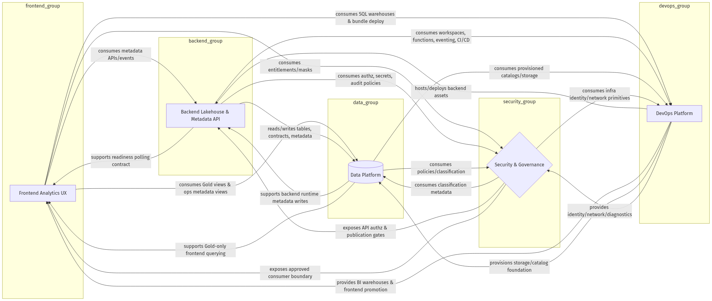

# plot-agent

> **BRD → Mermaid 架构图**：把一份业务需求文档丢给一组 LangGraph 多智能体，10 分钟后产出一张可读的 Mermaid 流程图、一份带 Self-Q&A 的方案摘要，以及导出的 PNG。

[](./LICENSE)
[](https://www.python.org/)
[](https://github.com/langchain-ai/langgraph)



> *上图：把一份 Databricks Lakehouse BRD 喂进去，11 分钟后自动产出。*

---

## 为什么再做一个"AI 画图"

大多数 LLM 画图方案让单个模型既要规划又要出最终产物，错误累积严重。**plot-agent** 的思路：

1. **职责拆给多个 agent**：planner 给方案 → 5 个 executor (frontend/backend/data/devops/security) 多轮互审 → reviewer 把关 → mermaid_maker 出结构化 IR → renderer 出图。
2. **Harness 工程**：每个 agent 的输入/输出由 Pydantic schema 锁住；LLM 失败 → repair loop → 仍失败 → 抛 `LLMCallError`，**绝不静默 fallback 假数据**（开源仓库里看不到任何业务偏见的硬编码）。
3. **Mermaid IR 解耦**：LLM 只产 IR，文本生成与 PNG 渲染都由代码完成；可换 graphviz / drawio / excalidraw 等任意后端。
4. **可观测**：state 自带 `trace` append-only 日志 + 每节点 `AIMessage`；`stream_mode="updates"` 实时打每个 agent 返回。

---

## Pipeline 拓扑

```
    START
      │
      ▼
   planner ── (TechPlan + Self-Q&A CoT)
      │
      ▼
  ┌───────── executors subgraph ─────────┐
  │ frontend → backend → data            │
  │      → devops → security → gate      │   ← N 轮互审，共享 designs / scratchpad
  └──────────────┬───────────────────────┘
                 │
                 ▼
            reviewer ── (ReviewReport, ok? target_role?)
                 │
        ┌────────┴───────┐
        │ ok=false &     │ ok=true | review_rounds 达额度
        │ rounds < N     │
        ▼                ▼
     回到 executors   mermaid_maker → mermaid_renderer → END
```

| Agent | 职责 | 产物 schema |
| --- | --- | --- |
| `planner` | 读 BRD，自问自答（前端/后端/runtime/集成/部署/secret/数据库/未决问题） | `TechPlan` |
| `executors/{role}` × 5 | 读 plan + 同伴 designs + reviewer 反馈，迭代自己那块 | `ComponentDesign` |
| `reviewer` | 检查接口/依赖/部署一致性，指出 `target_role` | `ReviewReport` |
| `mermaid_maker` | designs → 节点/边/分组 | `MermaidIR` |
| `mermaid_renderer` | IR → `.mmd` + `summary.md` (+可选 PNG via Kroki/mmdc) | 文件 |

---

## 快速开始

### 安装

```bash
git clone https://github.com/LovHan/plot_agent.git
cd plot_agent

poetry install                  # 注册 plot-agent 命令
cp .env.example .env            # 然后填 OPENAI_API_KEY
```

可选：

```bash
poetry add pypdf                          # 直接喂 .pdf 作为 BRD
npm i -g @mermaid-js/mermaid-cli          # 离线 PNG 渲染（不装则走 Kroki）
```

### CLI

```bash
plot-agent --help

# 全链路：BRD → planner → executors → reviewer → mermaid → PNG
plot-agent generate samples/databricks_brd.txt

# .pdf 输入；不出 PNG，只要 .mmd + summary.md
plot-agent generate samples/Databricks_Project_BRD.pdf --no-png

# 已有 .mmd 重新出 PNG（零 token，秒级）
plot-agent render out/diagram.mmd
plot-agent render out/diagram.mmd --backend mmdc --out diagram.png
```

输出默认放在 `out/`：

```
out/
├── diagram.mmd        # mermaid 源码
├── diagram.png        # 渲染图（默认 Kroki HTTP，可换 mmdc）
└── summary.md         # plan + designs + review + mermaid 嵌入
```

### Python API

```python
from plot_agent import build_brd_to_mermaid_pipeline
from plot_agent.memory import make_checkpointer, make_store

app = build_brd_to_mermaid_pipeline(
    checkpointer=make_checkpointer(),
    store=make_store(),
)

result = app.invoke(
    {
        "brd": open("samples/databricks_brd.txt").read(),
        "out_dir": "out",
        "render_png": True,
    },
    {"configurable": {"thread_id": "demo"}, "recursion_limit": 50},
)
print(result["mermaid_code"])
```

---

## 工程结构

```
plot_agent/
├── cli.py                       # argparse CLI: generate / render
├── llm.py                       # call_structured: LLM→JSON→schema, repair loop, LLMCallError
├── schemas.py                   # TechPlan / ComponentDesign / ReviewReport / MermaidIR
├── state.py                     # MultiAgentState + reducers
├── memory.py                    # InMemorySaver / InMemoryStore 工厂
├── graph/
│   ├── builder.py               # 顶层 pipeline 装配
│   ├── nodes/
│   │   ├── planner.py
│   │   ├── reviewer.py
│   │   ├── mermaid_maker.py
│   │   ├── mermaid_renderer.py
│   │   └── routing.py
│   └── subgraphs/
│       ├── executors.py         # round-robin 子图
│       └── roles/
│           ├── _common.py       # context slicing + run_role()
│           ├── frontend.py / backend.py / data.py / devops.py / security.py
└── render/
    ├── __init__.py
    └── png.py                   # Kroki HTTP (默认) + mmdc fallback
tests/
├── conftest.py                  # stub_llm fixture：CI 不需要 OPENAI_API_KEY
└── test_smoke.py                # 4 个测试：端到端 / 带 memory / 互动证据 / 失败传播
samples/
├── databricks_brd.txt
└── Databricks_Project_BRD.pdf
```

---

## 配置

`.env` 支持的变量（参见 `.env.example`）：

| 变量 | 默认 | 说明 |
| --- | --- | --- |
| `OPENAI_API_KEY` | — | 必填 |
| `OPENAI_BASE_URL` | `https://api.openai.com/v1` | OpenAI 兼容端点（Azure / vLLM / Ollama-shim 都行） |
| `PLANNER_MODEL` | — | planner / executors / mermaid_maker 用 |
| `CRITIC_MODEL` | 回退 PLANNER_MODEL | reviewer 用 |
| `OPENAI_MODEL` | 最末层兜底 | 当上面都未设时使用 |
| `KROKI_URL` | `https://kroki.io` | 私有部署的 Kroki 时改这里 |
| `KROKI_TIMEOUT` | `30` | 秒 |

调参：

| 位置 | 默认 | 说明 |
| --- | --- | --- |
| `subgraphs/executors.py::MAX_EXECUTOR_TURNS` | 2 | executor 子图轮数 |
| `nodes/reviewer.py::MAX_REVIEW_ROUNDS` | 2 | reviewer 不通过最多回 executors 几次 |
| `llm.py::_NETWORK_RETRIES` | 3 | LLM 网络瞬态错误重试 |

---

## 测试

```bash
poetry run pytest -q
```

`tests/conftest.py` 用 `monkeypatch` 把 `_invoke_llm` 替换成按 system prompt 关键词路由的 stub JSON——CI 不需要任何 API key，且测试用的 stub 数据**与生产代码完全隔离**。

---

## Harness Engineering 落地点

| 维度 | 实现 |
| --- | --- |
| **Context slicing** | `_role_context()` 给每个 executor 只喂 plan + 同伴 designs + scratch + 针对自己的 reviewer feedback |
| **Schema hard-contract** | 每个 agent 输入输出走 Pydantic；LLM 必须出 JSON |
| **Repair loop** | `call_structured` 解析失败把 error 拼回 prompt 再试，到顶则抛 `LLMCallError` |
| **Network retry** | `_invoke_llm` 对 `APIConnectionError`/`APITimeoutError`/`RateLimitError` 指数退避重试 |
| **Bounded retries** | `MAX_EXECUTOR_TURNS=2` / `MAX_REVIEW_ROUNDS=2`，强制收敛 |
| **Memory 双层** | `InMemorySaver`（thread 级 checkpoint）+ `InMemoryStore`（项目级长期记忆） |
| **Observability** | append-only `trace` 字段 + 每个节点 `AIMessage`；`app.stream(..., stream_mode="updates")` 拿 per-node 事件 |
| **No silent fallback** | 失败永远抛 `LLMCallError`，由调用方决定如何处理；包内不内置任何业务硬编码兜底 |

---

## Roadmap

- [ ] Reviewer feedback 只重跑 `target_role`，而不是全员再跑一轮
- [ ] `graph_linter` 节点：自动检测依赖环并触发重试
- [ ] `Send` API 并行 executors（一轮 5 个 role 同时跑，从 ~10min 压到 ~2min）
- [ ] `SqliteSaver` 持久 checkpointer，跑到一半崩可续跑
- [ ] Human-in-the-loop：reviewer issues 出现时打断 graph，等人工确认
- [ ] 多 backend：Graphviz / Excalidraw / draw.io 渲染目标
- [ ] LangSmith / LangFuse tracing 集成

欢迎 PR / Issue。

---

## License

[MIT](./LICENSE)
